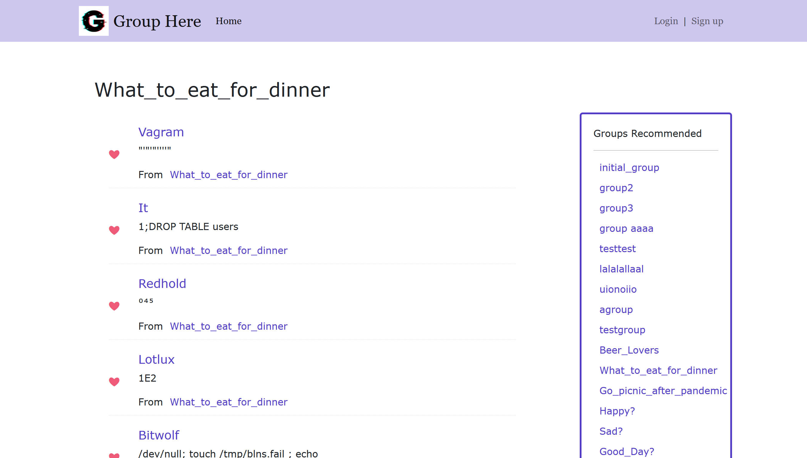

# Group Here
Author: Tiange He & Ning Ding

Class Link: [here](https://johnguerra.co/classes/webDevelopment_spring_2021/)

Project Link: [here](https://group-here.herokuapp.com/)

This is a light-weight social platform for person to discuss on any topic they want. User can create group and join them.

Video demo：[here](https://youtu.be/JRdcbpOwE0M)

## Project Objective

- Making a social platform that allows user to discuss according to the group topic.
- User can join group and make comments on other users’ posts.
- support authentication.

## Screenshots

Homepage


group page


## Setup

- For delopying: 

In /group-here
```
yarn install
cd front
yarn install
yarn build
cd ..
yarn start
```

- For development:

For hot deploy, in /group-here
```
yarn install
yarn nodemon
```
This runs on localhost:3000

in group-here/front
```
cd front
yarn install
yarn start
```
This runs on localhost:3001
